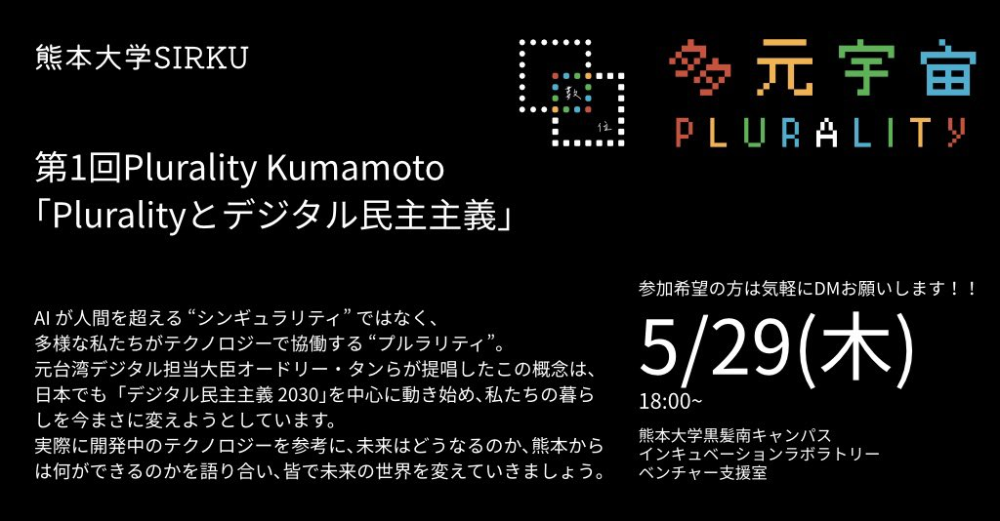

# プルラリティとデジタル民主主義 - 熊本コミュニティ設立イベント

## 基本情報

- **開催日時**: 2025年5月29日（木）18:00〜19:00
- **開催場所**: 熊本大学黒髪南キャンパス インキュベーションラボラトリ ベンチャー支援室
- **主催者**: くまもとVOICE
- **参加者数**: 10名程度
- **参加費**: 無料
- **イベント形式**: 勉強会・ディスカッション

## イベント概要

### 目的・テーマ
熊本で**プルラリティのコミュニティを設立すること**を主な目的として開催。プルラリティという概念を単なるミームで終わらせず、実際に社会に影響を与えるためのコミュニティを日本各地に作る必要性を共有。

### タイムテーブル
- 18:00 - 18:15: プルラリティとデジタル民主主義についての紹介
- 18:15 - 18:30: 現在使用されている技術（AI関連）についての説明
- 18:30 - 18:45: 元熊本市長の幸山氏と登壇者による質疑応答形式の議論
- 18:45 - 19:00: 参加者からの質疑応答
- 19:00 - 19:15: 懇親会

## 登壇者・講師

### 智基/Tomoki氏
- https://x.com/tomolld
-
### 幸山政史氏（元熊本市長）
- https://x.com/Kohyama_office

## セッション内容

### 1. プルラリティとデジタル民主主義

#### プルラリティとは
一言で言えば、「**分断を乗り越え、コラボレーションするための技術**」を指す。台湾の元デジタル担当大臣である**オードリー・タン氏**と、マイクロソフトリサーチの経済学者である**グレン・ワイル氏**が提唱した概念。

#### 具体的な成功事例
**台湾のマスクマップ**: コロナ禍において、プルラリティやデジタル民主主義のコミュニティが協力し、どこでマスクが手に入るかを可視化することで、マスク価格の高騰を防いだ事例。政治だけでなく、「どこで米が安く買えるか」といった情報を行政や消費者が協力して公共財として提供するといった応用も可能。

#### なぜ今プルラリティが注目されているのか
- **世界的な民主主義の行き詰まり**: グローバル化や情報化により意見が多様化し、個人の意見が政策に反映されにくくなっている。また、技術の進歩が速いにもかかわらず、選挙が4年に1度しか意思決定の場がないため、意見が反映されにくい
- **テクノロジーの発展による新たなイデオロギーの誕生**: ブロックチェーンやAIといった技術の発展が、プルラリティへの注目を促している

#### 21世紀のイデオロギー
ゲーム「シビライゼーション」の図を引用し、以下の3つのイデオロギーが紹介された：

1. **シンセティック・テクノクラシー（合成テクノクラシー）**
   - シンギュラリティやAI（OpenAI、イーロン・マスクの動向など）によって人類の課題が解決できるとする考え方
   - 懸念点: **特定の強力なAI企業が政治と結びつき、独裁が強まる可能性**

2. **コーポレート・リバタリアニズム**
   - テクノロジーによって個人を解放しようとする企業化された動き（暗号通貨、ビットコインなどに関連）
   - 懸念点: **極端な格差拡大**

3. **デジタル民主主義**
   - 上記2つのイデオロギーの懸念点を踏まえつつ、**テクノロジーを用いて民主主義をアップデートする第三の道**として位置づけ

### 2. デジタル民主主義の具体例と技術

参院選でも活用されるような技術が紹介された。

#### 広聴AI（ブロードリスニング）
- 様々な媒体から意見を収集し、**可視化するAI**
- 政府が行うパブリックコメント（例：AIの政治活用に関する意見募集）で、数千〜数万件のコメントを人間が読むのは不可能であるため、AIがクラスタリングして可視化し、人々の意見を分かりやすくする
- 以前から意見のベクトル化は行われていたものの、**LLM（大規模言語モデル）の登場により、特に日本語での精度が大幅に向上した**ことで、より実用的になった
- 同じ文章の繰り返しや少しだけ変えた文章（コピペなど）をAIが判別できるため、**組織的な意見と個々の意見を区別することが可能**

#### 井戸端AI
- 既存の政策に対して、ユーザーがチャットで意見を送ると、AIがその意見について質問を重ね、**意見を要約・整理してくれる**システム
- ユーザーとAIが共同で政策提言を作成できる

#### AIファクトチェッカー
- 登壇者が開発したもので、**ネット上の偽情報（デマ）の氾濫を抑制する**ためのAI
- 選挙などで広がるデマ（例：コロナワクチン、特定の政党に関する虚偽情報）に対し、AIが自動的にチェックし、誤りであることを訂正する機能を持つ

## 質疑応答・ディスカッション

### 元熊本市長 幸山氏の視点からの課題

**市民の声の収集について**
- もし広聴AIがあれば、市民の意見を広く集め、政策に反映させることができたと述べられた
- 市長時代には、直接対話や市民委員会（2000人規模の無作為抽出）などアナログな方法で市民の声を集めていたが、**「サイレントマジョリティ」の声を含め、より多くの意見を取り込むことが課題**だった

**権力構造との葛藤**
- AIの結論が政治家の意向と異なった場合、**既存の権力構造からの圧力や葛藤が生じる可能性**が指摘された
- 多数の意見が可視化された場合、首長から見てそれが間違っていると思っても反論しにくくなる可能性がある

**選挙制度の改革提案**
- 現行の選挙制度（4年に1度、1人1票）では多様な意見を反映しきれないと指摘
- 例えば**1人10票を複数候補に分配できる制度**があれば、より民意が反映されるのではないかとの考えが示された

### 高齢者のデジタルデバイド

**Q**: AIや先端テクノロジーが、高齢者層にとってはとっつきにくいのではないか？

**A**:
- AIは会話するだけで答えが出るため、**既存のテクノロジーよりも分かりやすい**
- スマートフォンへの文字入力だけでなく、ぬいぐるみなどのデバイスに話しかけるだけで音声で答えが返ってくる仕組みなど、**UX/UIの改善で高齢者も使いやすくなる**
- 必ずしも全員が使う必要はなく、**関心がある層には情報が届く**という捉え方も重要

### 組織票と真の民意の判別

**Q**: パブリックコメントで組織票のように大量の意見が寄せられた場合、AIでそれが本当に多数の意見なのか、一部の限られた人々の意見なのかを判別できるか？

**A**:
- **マイナンバーによる投稿者の個人識別**が対策案として提案されたものの、技術的・倫理的な課題が指摘された
- World ID（人間の虹彩スキャン）のような個人特定技術も可能性として挙げられた
- AIは、**文章の癖からコピペや組織的な投稿を判別できる**能力がある
- 「Plurality Tokyo」の創設者である高氏からは、従来の民主主義が「1人1票」で個人の特定（ボットでないこと）を重視するのに対し、プルラリティは**「意見の幅の広さ」を数値で捉えること**を重視しているとの見解が示された

### AIによる妨害と対策

**Q**: AIを阻害するAI（例：AIを使って大量のパブリックコメントを送る）が出てくる可能性はないか？

**A**:
- AI技術の**いたちごっこ**になるとの見方が示されたが、最終的には解決できるだろうとの見解も出た
- 特定の組織による人工的な組織票は判別できるため、影響は限定的になる可能性が指摘された
- 偽情報の氾濫については、アメリカ大統領選の例を挙げ、**段階的な進歩しか期待できない**と述べられた

### 予測市場

**概念の説明**
- 人々が未来の出来事（例：選挙結果、政策の効果）に対してお金をかけることで、**集合知による正確な予測を得るメカニズム**
- 特に「インサイダー情報」を持つ人が参加することで、従来の選挙アナリストやニュースメディアよりも**高い予測精度**を示すことが実証されている

**政策決定への応用**
- 特定のKPI達成（例：社会保障制度の補足率向上）において、複数の選択肢（例：A社、B社、C社）のうちどれが最も目標を達成できるかを、**参加者が予測し、賭ける**ことで、最も確度の高い選択肢を見つけることができる
- 「何を決定するか（What）」は民主主義で決めつつ、「**どのように実行するか（How）**」において、情報を持つ人々のインセンティブに基づいた意思決定を促進する

**課題と対策**
- 懸念点として、金銭が絡むことによる格差拡大が挙げられたが、これはあくまで「最も起こりうる事実を予測する」プロセスであり、**意思決定の精度を高めるツール**として捉えるべき
- 日本ではリアルマネーを用いた予測市場は現在違法だが、サンドボックス制度を活用して実施が検討されている

## 学習・気づき

### 新しい発見
- プルラリティが単なる概念ではなく、実際に台湾で成功事例があること
- LLMの進歩により、日本語での政治的意見の分析が実用レベルに達していること
- 予測市場が民主主義の「How」部分を補完する仕組みとして機能する可能性

### 疑問・課題
- 組織票とボット対策の実効性
- 高齢者層への普及における現実的な課題
- 既存の政治権力との摩擦をどう解決するか

### 今後調べたいこと
- 台湾以外でのプルラリティ実装事例
- 広聴AIの具体的な技術仕様
- 日本でのサンドボックス制度による予測市場の進展状況

## 今後のアクション（案）

- 熊本でのプルラリティコミュニティ参加者募集の検討
- 広聴AIや井戸端AIの技術詳細調査
- 台湾のデジタル民主主義事例の詳細研究
- 熊本市での小規模なデジタル民主主義実験の企画
- 地域課題をテーマにした意見収集システムの試作
- 他地域のプルラリティコミュニティとの連携検討
- 熊本県・市レベルでのデジタル民主主義導入提案
- くまもとVOICEとしてのプルラリティ実装プロジェクト立ち上げ

## 関連リンク・参考資料

- [デジタル民主主義](https://dd2030.org/)
- [NotebookLM:デジタル民主主義リサーチ](https://notebooklm.google.com/notebook/dbac1650-ae8a-427e-99c4-54dc77a51680)
- [グレン・ワイル氏関連資料](URL)

## 写真・資料

### イベントの様子

*熊本大学インキュベーションラボラトリでの勉強会*

*幸山元市長を交えた活発なディスカッション*

### 配布資料
- [プルラリティ概要資料](./materials/plurality_overview.pdf)

## 参加者の感想

### くまもとVOICEメンバー
- デジタル民主主義の可能性と課題が具体的に理解できた
- 台湾の成功事例が非常に参考になった
- 熊本でも何かできることがあるのではないかと感じた

## 今後予告・関連イベント
- 今後: 2025年6月24日 [熊本AI/DX 革新展](https://kakushin.lbose.co.jp/) 参加予定
- 今後: 2025年6月26日 [プルラリティとは何か？哲学者がエンジニアに民主主義の新たな構想を聞く](https://www.youtube.com/@Genron.Co_Ltd)を観る会

---

**レポート作成者**: くまもとVOICE 清田
**作成日**: 2025年6月8日
**最終更新**: 2025年6月8日
